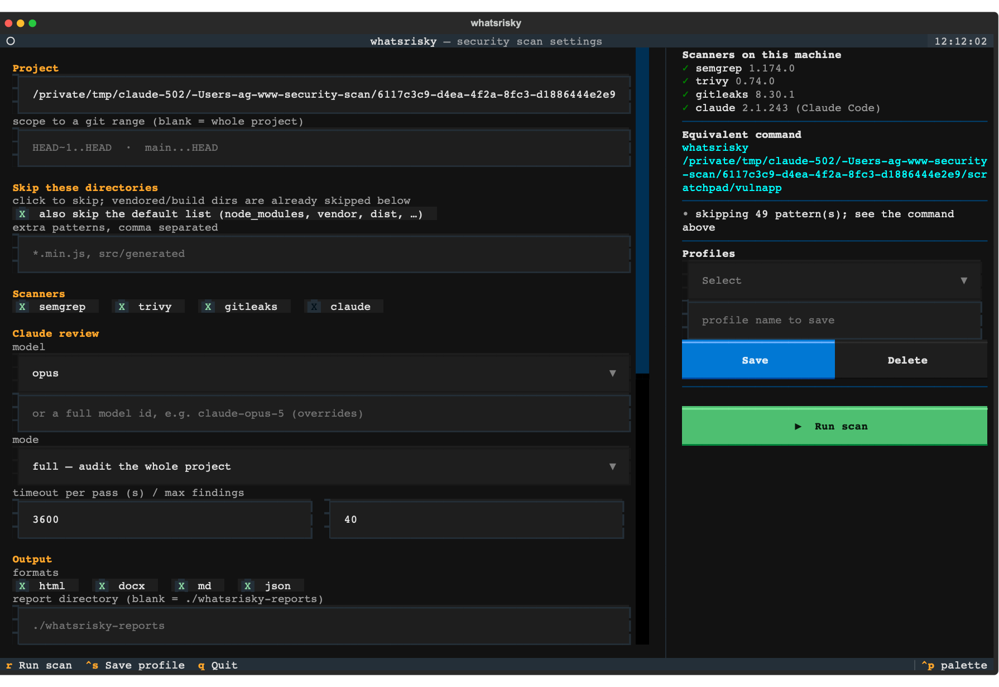

# whatsrisky

**What's risky in this project?** Point it at a path, get one prioritized security
report — a page for people, JSON for machines.

Four scanners, one severity scale, one document:

| Scanner | Covers |
| --- | --- |
| **Semgrep** | First-party source code (SAST) |
| **Trivy** | Dependency CVEs, IaC / container misconfiguration, optionally secrets |
| **gitleaks** | Hardcoded secrets in the working tree *and* in git history |
| **An LLM** | Review of logic, authn/authz and data flow — whole-project audit or the branch diff |

The report is the point. Not a wall of tool output: a view that says what to fix
first, why it is exploitable, where it is, what changed since last time, and — the
part scanners usually hide — **what was not scanned at all**.


## Install

```bash
curl -sSfL https://raw.githubusercontent.com/smagew/whatsrisky/main/install.sh | sh -s -- -b /usr/local/bin
whatsrisky doctor          # what the scanners look like on this machine
```

One static binary, no runtime. Or grab an archive from
[releases](https://github.com/smagew/whatsrisky/releases), or `go install
github.com/smagew/whatsrisky/cmd/whatsrisky@latest`.

From a clone, to run whatever is checked out:

```bash
make install                    # builds onto ~/.local/bin
make install PREFIX=/usr/local/bin
```

Re-run it after switching branches: a binary does not follow the source the way an
editable Python install did.

The three scanners are separate binaries (`semgrep`, `trivy`, `gitleaks`) —
`doctor` tells you what is missing and how to get it on your platform. The AI pass
runs **by default**, and `--no-ai` drops it: it spends money on your account and
sends your code to a third party, so the flag that refuses it is short and has the
last word.

## Use

```bash
whatsrisky ~/www/app                      # semgrep + trivy + gitleaks
whatsrisky ~/www/app --open               # …and open the report when it is done
whatsrisky ~/www/app --ai                 # add the AI review pass (costs tokens)
whatsrisky ~/www/app --diff HEAD~1..HEAD  # only what this range changed
whatsrisky ~/www/app --min-severity HIGH
whatsrisky ~/www/app --fail-on high       # exit 2 for CI when HIGH+ exists
whatsrisky                                # no arguments: the settings UI
```

## The report view

`report.html` is one self-contained file — no network, no tooling, double-click it.
It carries the findings and the data behind them, so it is both the view and the
machine-readable record.

- **Group** by severity, category, source, who found it, directory, or status.
- **Filter** by severity, category, source, detector and free text; filters compose
  and live in the URL hash, so a filtered view is a link you can paste to someone.
- **Coverage gaps sit with the counts**, not in an appendix — a scanner that did
  not run means that area is unscanned, and the verdict itself says
  `partial coverage (trivy did not run)`.
- **Resolved findings** are one click away and never inflate the open counts.
- Three themes, the same tokens as [whydiff](https://github.com/smagew/whydiff), so
  the two windows read as one family.

It is written **before the first scanner starts** and rewritten after each one, so
you can open it while the scan is still running: it says `scanning — 1 of 3 done`,
names the pending scanners, and never reports "clean" before it knows. In the
terminal UI, `v` opens it from the first second.


## Settings UI

`whatsrisky ui` (or the bare command) opens a form for every option, with a live
**Equivalent command** panel — you always see the flags your choices produce, so
the UI is a way to *learn* the CLI rather than an alternative to it. It also shows
which scanners are actually installed, and warns before you run: a bad path, a
missing API key, an AI backend asked to do something it cannot, a scanner that is
switched on but not installed — and what that one would have checked.

`ctrl+r` runs the scan, `ctrl+s` saves the current settings as a named
**profile**, `ctrl+i` lists the 49 folders and files a scan always skips. Move
with `tab` and the arrows, or click: a click ticks a scanner, opens a list, picks
from it, or puts the cursor in a field. Only text is typed.

Every setting is on one screen — no pages, no scrolling. Where the terminal is
too short for one column the settings go into two, and where there is no room for
the panel beside them, `ctrl+p` brings it up.



<!-- This screenshot predates the tview rebuild in 0.4.0 and shows the old
     interface. It needs retaking on a real terminal. -->

Settings are saved into the project as `.whatsrisky.json`, so the next launch in
that folder starts from them and a launch anywhere else does not. Commit it and the
team scans the same way. It holds no path, no diff range and no baseline — those
belong to one run. A named profile (`--profile ci-fast`) still overrides it, and a
flag on the command line overrides both.

Saving a profile is the last section, not the first: the first thing asked for
should be what to scan, not what to call the settings you have not chosen yet. The
one you saved is what the next launch starts from — the header says which. Profiles work from the CLI
too, so the UI and CI share one configuration:

```bash
whatsrisky ui --profile ci-fast                     # open the UI on a profile
whatsrisky ~/www/app --profile ci-fast              # run a saved profile
whatsrisky ~/www/app --profile ci-fast --ai         # profile, then override
whatsrisky ~/www/app --save-profile nightly         # save while scanning
whatsrisky profiles                                 # list, with the active one marked
```

A profile says **how** to scan, not **what**: the project path, the git range, the
baseline and an explicit output file are per-invocation and are not stored, so
reusing a profile on another project cannot drag the old project along with it.

## Rescans: what did we fix?

A second scan compares itself against the previous report in the output directory
and gives every finding a status:

```
vs myapp-20260824-231344: 3 new · 18 open · 5 resolved · 1 reintroduced · 2 moved
```

- **resolved** findings are carried into the new report, so "we fixed five things"
  is visible rather than inferred from a shrinking total.
- **moved** means a finding was tracked through code that changed place. A finding
  is identified by three keys — its exact location, then the evidence itself, then
  its location without the line — so moving a function to another file keeps its
  history instead of reporting a fix plus a regression.
- resolved and accepted findings never inflate the counts, the risk score, the
  verdict or the exit code. They are history and decisions, not open work.

```bash
whatsrisky ~/www/app                          # compares against the latest report
whatsrisky ~/www/app --baseline old.json      # compare against a specific one
whatsrisky ~/www/app --no-compare             # don't
```

## The AI pass, and who runs the model

An LLM reviewer reads the logic the rule-based scanners cannot: authorization
holes, data flow across files, business rules. It runs by default; `--no-ai`
drops it, and does so whatever else is on the line — naming a model does not
quietly turn it back on.

| `--ai-provider` | Sees | Can review a diff |
| --- | --- | --- |
| `claude-cli` (default) | **explores the repository itself** with read tools | yes, via the `security-review` skill |
| `openai` | only the files we send it, within `--ai-context-bytes` | no — it has no access to git |

An agentic backend decides what to open and follows a taint through the codebase;
an API backend is handed a slice we chose. Those are different analyses of
different strength, so the report records which one ran — `openai · gpt-5 · was
given a fixed context … saw 14 file(s)` — instead of presenting them as
equivalent.

```bash
export OPENAI_API_KEY=…
whatsrisky ~/www/app --ai-provider openai --model gpt-5
whatsrisky ~/www/app --ai --model sonnet          # claude-cli, cheaper model
whatsrisky ~/www/app --ai --ai-mode review        # the branch diff (agentic only)
```

When a backend cannot do something it says so rather than returning a confident
empty result: asking `openai` for `--ai-mode review` fails with "it has no access
to git — use `--ai-mode full`, or `--ai-provider claude-cli`".

## What gets skipped

Vendored and generated code produces findings nobody can act on, in code nobody in
the project wrote, so a default skip list is applied: `node_modules`, `vendor`,
`.venv`, `dist`, `build`, `target`, `.next`, `__pycache__`, caches, minified
bundles and the like.

```bash
whatsrisky . --show-excludes                 # the effective list, and each entry's origin
whatsrisky . --exclude legacy --exclude '*.pb.go'
whatsrisky . --no-default-excludes           # scan the vendored code too
```

A bare name (`legacy`) matches that directory at any depth; a pattern with a slash
(`src/generated`) matches that subtree; a glob (`*.min.js`) matches the path, the
basename or any single segment.

Exclusions reach every scanner, including the ones with no flag for it: gitleaks
gets a generated allowlist config, and the AI pass is told which paths to ignore.
Anything that still slips through is dropped afterwards and **counted** — the
report says how many findings the exclusions removed, rather than quietly
shrinking. The tool also never scans its own output: report directories are marked,
so a second run does not rediscover the secrets quoted in the first run's report.

## Progress

Long scans are not silent. Each scanner reports what it is doing right now, live:

```
⠹ semgrep    12s  Scanning 412 files tracked by git with 1074 Code rules
▪ trivy       2s  20 findings · ok
⠙ ai         47s  Read src/auth/session.py
```

That last line is real: the agentic AI backend runs with
`--output-format stream-json`, so you see which files the reviewer is opening
instead of watching a spinner for four minutes.

## Embedding

`internal/scan` holds the whole scan: `Options` (every setting, serializable) and
`Run(options, handler)`, which reports progress through a callback and never
touches a terminal. The CLI and the UI are thin shells over it, which is also why
the UI can render the exact equivalent command.

As a subprocess — one JSON document on stdout, nothing else:

```bash
whatsrisky /srv/app --diff main...HEAD --json-stdout > findings.json
```

The shape is a versioned contract:
[`schema/report.schema.json`](schema/report.schema.json). `schema_version` is
bumped on any breaking change, and every finding carries stable identity keys
suitable as suppression or correlation keys.

## Honesty notes

These are deliberate, not oversights:

- **`--diff` does not scope Trivy.** A dependency CVE is a property of the
  manifest, not of the changed lines: a lockfile untouched by your range can still
  be vulnerable. Trivy scans the whole tree and the report says so, instead of
  quietly reporting "0 findings" for a diff.
- **Exclusions are counted, not silent.** Dropping a finding is a decision; the
  report records how many were dropped and which patterns were in effect.
- **A missing scanner is not a clean result.** The report lists coverage gaps for
  exactly this reason, and the JSON `tools[].status` tells a machine the same.
- **The risk score ranks, it does not measure.** `100·(1−e^(−Σweights/120))`
  saturates by design.
- **Automated scanning is a floor.** It does not replace threat modelling,
  authenticated dynamic testing, or a human reading the business logic.

## Severity model

Tool-native severities are mapped onto one scale (`internal/model`):

- Semgrep `ERROR` → HIGH, promoted to CRITICAL when the rule metadata says high
  impact and high confidence; `WARNING` → MEDIUM; `INFO` → LOW.
- Trivy severities map 1:1.
- gitleaks has no severity: provider-specific rules → CRITICAL, generic/entropy
  rules → HIGH, and matches under test/fixture/example paths drop one notch.
- The LLM is given an explicit rubric in the prompt and returns the severity
  directly.

Every finding also carries a normalized `category` from a closed vocabulary
(`injection.sql`, `secret`, `path-traversal`, `crypto`, `dependency`,
`misconfiguration`, …) and a `source` (`source-code`, `dependency-manifest`,
`git-history`, `iac`, `container`, `ci-config`). The category comes from the
strongest signal available, and the order matters: the scanner's own class, then
unambiguous tokens in the rule id, then the artifact, then CWE, then fuzzy
keywords. Rule ids outrank CWE deliberately — semgrep tags its own
`injection.tainted-sql-string` rule with CWE-915, which would file a SQL injection
under deserialization.

## Development

```bash
make check       # gofmt + vet + tests + the self-scan gate
make test        # -short: no scanner binaries needed
make test-all    # everything, against the real scanners
make build-all   # every release archive into dist/
make live-ai     # the AI pass against the real claude CLI (spends tokens)
```

The vulnerable sample project used by the tests is generated at test time
(`internal/fixture`) — this repository contains no credentials, real or fake, so it
does not trip secret scanners or GitHub push protection.

## Layout

- `cmd/whatsrisky` — the CLI and its subcommands.
- `internal/model` — severity, findings, categories, the report and its verdict rules.
- `internal/scan` — options, exclusions, diff scoping, the run itself, live writing.
- `internal/runner` — one file per scanner, plus the AI runner and its prompts.
- `internal/ai` — who runs the model: the backend contract, claude-cli, openai, and
  the context builder for backends that cannot read the repository.
- `internal/compare` — rescan correlation. `internal/report` — JSON, HTML
  (`templates/viewer.html`, embedded), Markdown. `internal/ui` — the terminal UI.
- `testdata/parity` — what the Python implementation computed, frozen. The tests
  still check against it.

## History

Versions up to 0.2.0 were written in Python and produced a DOCX report as well.
That version is tagged `v0.2.0-python`:

```bash
git checkout v0.2.0-python && uv tool install --editable .
whatsrisky <path> --format docx
```

`docs/go-rewrite.md` records why the rewrite happened, what it dropped, and how
parity was proven rather than claimed.

## License

MIT — see [LICENSE](LICENSE). The scanners are separate programs invoked as
subprocesses; their own licenses (Semgrep LGPL-2.1, Trivy Apache-2.0, gitleaks MIT)
are unaffected by this one. The `claude-cli` backend depends on Anthropic's
proprietary CLI and is therefore optional, as is every AI backend.
