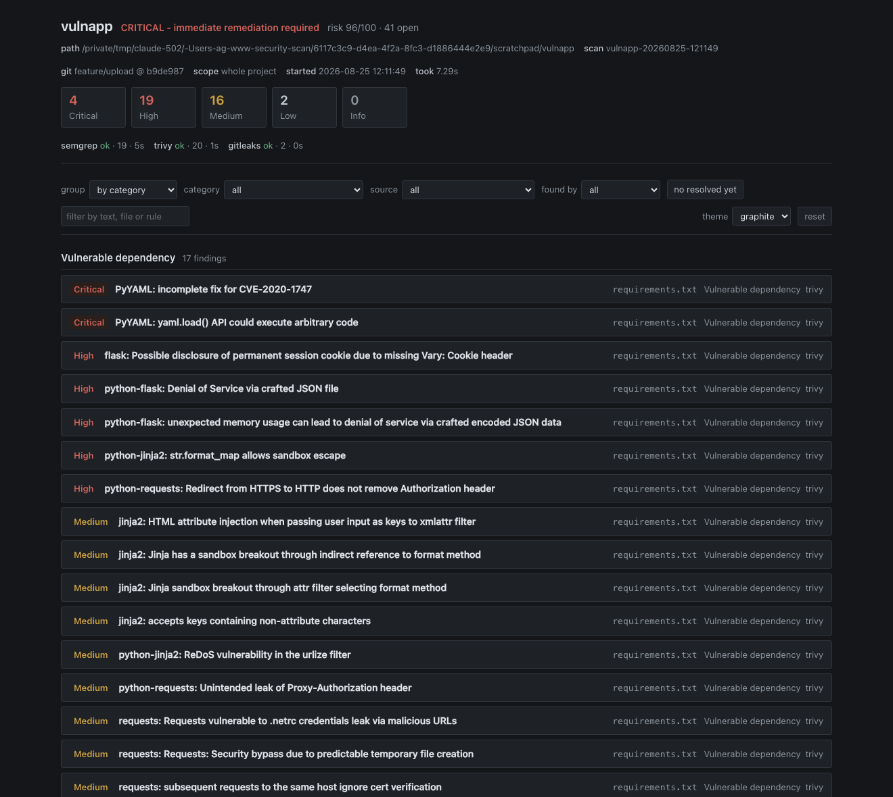
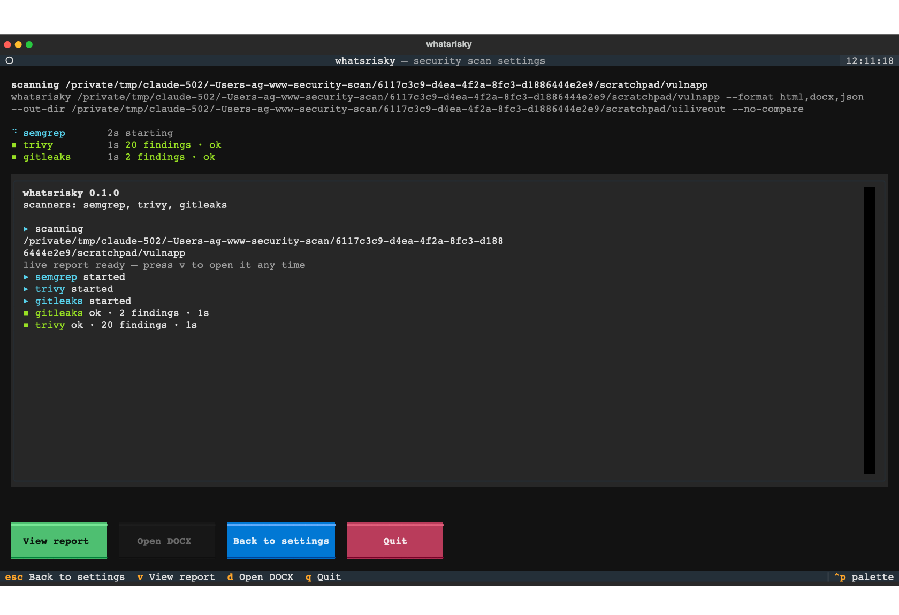

# whatsrisky

**What's risky in this project?** Point it at a path, get one prioritized security report — DOCX for people, JSON for machines.

Four scanners, one severity scale, one document:

| Scanner | Covers |
| --- | --- |
| **Semgrep** | First-party source code (SAST) |
| **Trivy** | Dependency CVEs, IaC / container misconfiguration, optionally secrets |
| **gitleaks** | Hardcoded secrets in the working tree *and* in git history |
| **An LLM** | Review of logic, authn/authz and data flow — whole-project audit or the branch diff |

The report is the point. Not a wall of tool output: a view that says what to fix first, why it is
exploitable, where it is, what changed since last time, and — the part scanners usually hide —
**what was not scanned at all**.



## Install

```bash
uv tool install whatsrisky        # or: pipx install whatsrisky
whatsrisky doctor --install       # checks the scanners, offers to install the missing ones
```

From a clone:

```bash
git clone https://github.com/smagew/whatsrisky && cd whatsrisky
uv tool install --editable .
```

The three scanners are separate binaries (`semgrep`, `trivy`, `gitleaks`) — `doctor` tells you what
is missing and how to get it on your platform. The AI pass is **off by default**: it spends tokens on
your account and sends code to a third party.

## Use

```bash
whatsrisky ~/www/app                      # semgrep + trivy + gitleaks, reports in ./whatsrisky-reports
whatsrisky ~/www/app --open               # …and open the report when it is done
whatsrisky ~/www/app --ai                 # add the AI review pass (costs tokens)
whatsrisky ~/www/app --diff HEAD~1..HEAD  # only what this range changed
whatsrisky ~/www/app --exclude legacy --exclude '*.generated.py'
whatsrisky ~/www/app --min-severity HIGH --open
whatsrisky ~/www/app --fail-on high       # exit 2 for CI when HIGH+ exists
whatsrisky                                # no arguments: the settings UI
```

### The report view

`report.html` is one self-contained file — no network, no tooling, double-click it. It carries the
findings and the data behind them, so it is both the view and the machine-readable record.

- **Group** by severity, category, source, who found it, directory, or status.
- **Filter** by severity, category, source, detector and free text; filters compose and live in the
  URL hash, so a filtered view is a link you can paste to someone.
- **Coverage gaps sit with the counts**, not in an appendix — a scanner that did not run means that
  area is unscanned, and the verdict itself says `partial coverage (trivy did not run)`.
- **Resolved findings** are one click away and never inflate the open counts.
- Three themes, the same tokens as [whydiff](https://github.com/smagew/whydiff), so the two windows
  read as one family.

It is written **before the first scanner starts** and rewritten after each one, so you can open it
while the scan is still running: it says `scanning — 1 of 3 done`, names the pending scanners, and
never reports "clean" before it knows. The terminal UI enables **View report** (`v`) from the first
second; **Open DOCX** (`d`) stays disabled until the DOCX is actually written and says why.



### Settings UI

`whatsrisky ui` (or the bare command) opens a form for every option, with a live **Equivalent
command** panel — you always see the flags your choices produce, so the UI is a way to *learn* the
CLI rather than an alternative to it. It also shows which scanners are actually installed, warns
before you run (bad path, offline + `auto`, "the AI pass spends tokens"), and disables Run when the
settings cannot work.

`r` runs the scan on a live-progress screen; `ctrl+s` saves the current form as a named **profile**.

The profile picker is the first thing in the form, and the one you saved is the one the next launch
starts from — the window title says which. Profiles work from the CLI too, so the UI and CI share one
configuration:

```bash
whatsrisky ui --profile ci-fast                     # open the UI on a profile
whatsrisky ~/www/app --profile ci-fast              # run a saved profile
whatsrisky ~/www/app --profile ci-fast --ai         # profile, then override
whatsrisky ~/www/app --save-profile nightly         # save while scanning
whatsrisky profiles                                 # list, with the active one marked
```

A profile says **how** to scan, not **what**: the project path, the git range, the baseline and an
explicit output file are per-invocation and are not stored, so reusing a profile on another project
cannot drag the old project along with it.

Everything lives in `~/.config/whatsrisky/config.json`. The UI remembers its own form; a CLI run does
not overwrite it, so a scripted `--out-dir /tmp/x` cannot leak into the interactive defaults.

### What gets skipped

Vendored and generated code produces findings nobody can act on, in code nobody in the project
wrote, so a default skip list is applied: `node_modules`, `vendor`, `.venv`, `dist`, `build`,
`target`, `.next`, `__pycache__`, caches, minified bundles and the like.

```bash
whatsrisky . --show-excludes                 # the effective list, and where each entry came from
whatsrisky . --exclude legacy --exclude '*.pb.go'
whatsrisky . --no-default-excludes           # scan the vendored code too
```

A bare name (`legacy`) matches that directory at any depth; a pattern with a slash
(`src/generated`) matches that subtree; a glob (`*.min.js`) matches the path, the basename or any
single segment. In the UI, the top of the form lists the project's own directories as checkboxes —
click the ones to skip instead of typing patterns.

Exclusions reach every scanner, including the ones with no flag for it: gitleaks gets a generated
allowlist config, and the AI pass is told which paths to ignore. Anything that still slips through is
dropped afterwards and **counted** — the report says how many findings the exclusions removed,
rather than quietly shrinking.

The tool also never scans its own output: report directories are marked, so a second run does not
rediscover the secrets quoted in the first run's report.

### Progress

Long scans are not silent. Each scanner reports what it is doing right now, live:

```
⠹ semgrep    12s  Scanning 412 files tracked by git with 1074 Code rules
▪ trivy       2s  20 findings · ok
⠙ claude     47s  Read src/auth/session.py
```

That last line is real: the AI pass runs with `--output-format stream-json`, so you see which files
the reviewer is opening instead of watching a spinner for four minutes. On a non-terminal (CI, pipes)
the same information is printed as plain lines.

### Rescans: what did we fix?

A second scan compares itself against the previous report in the output directory
and gives every finding a status:

```
vs myapp-20260824-231344: 3 new  ·  18 open  ·  5 resolved  ·  1 reintroduced  ·  2 moved
```

- **resolved** findings are carried into the new report, so "we fixed five things" is
  visible rather than inferred from a shrinking total.
- **moved** means a finding was tracked through code that changed place. A finding is
  identified by three keys — its exact location, then the evidence itself, then its
  location without the line — so moving a function to another file keeps its history
  instead of reporting a fix plus a regression.
- **reintroduced** is a finding that was fixed and came back.
- resolved and accepted findings never inflate the counts, the risk score, the verdict
  or the exit code. They are history and decisions, not open work.

```bash
whatsrisky ~/www/app                          # compares against the latest report automatically
whatsrisky ~/www/app --baseline old.json      # compare against a specific one
whatsrisky ~/www/app --no-compare             # don't
```

### Grouping axes

Every finding carries the axes the view groups by, so a machine reading the JSON sees the same
structure a person sees in the browser.

A normalized `category` from a closed vocabulary (`injection.sql`, `secret`, `path-traversal`,
`crypto`, `dependency`, `misconfiguration`, …) and a `source`
(`source-code`, `dependency-manifest`, `git-history`, `iac`, `container`,
`ci-config`). `detector` records who found it — tool, and for the AI pass the provider and model.

The category comes from the strongest signal available, and the order matters: the scanner's own
class, then unambiguous tokens in the rule id, then the artifact, then CWE, then fuzzy keywords.
Rule ids outrank CWE deliberately — semgrep tags its own `injection.tainted-sql-string` rule with
CWE-915, which would file a SQL injection under deserialization.

### The AI pass, and who runs the model

`--ai` adds an LLM reviewer that reads logic the pattern scanners cannot: authorization holes,
data flow across files, business rules. It is off by default and it is never implicit.

Two backends today, and the difference is not cosmetic:

| `--ai-provider` | Sees | Can review a diff |
| --- | --- | --- |
| `claude-cli` (default) | **explores the repository itself** with read tools | yes, via the `security-review` skill |
| `openai` | only the files we send it, within `--ai-context-bytes` | no — it has no access to git |

An agentic backend decides what to open and follows a taint through the codebase; an API backend is
handed a slice we chose. Those are different analyses of different strength, so the report records
which one ran — `openai · gpt-5 · was given a fixed context … saw 14 file(s)` — instead of
presenting them as equivalent. `detector` on every finding carries the provider and the model.

```bash
export OPENAI_API_KEY=…
whatsrisky ~/www/app --ai-provider openai --model gpt-5
whatsrisky ~/www/app --ai --model sonnet          # claude-cli, cheaper model
whatsrisky ~/www/app --ai --ai-mode review        # the branch diff (agentic backends only)
```

When an API backend cannot do something, it says so rather than returning a confident empty result:
asking `openai` for `--ai-mode review` fails with "it has no access to git — use `--ai-mode full`,
or `--ai-provider claude-cli`".

### Flags that matter

- `--ai` — add the AI pass. Naming `--ai-provider`, `--model` or `--ai-mode` implies it.
- `--ai-provider claude-cli|openai` — who runs the model. Keys come from the environment
  (`OPENAI_API_KEY`, and `OPENAI_BASE_URL` to point at a compatible endpoint).
- `--model <id>` — free-form; blank means the backend's own default.
- `--ai-mode full|review|both` — audit the whole project, review the diff, or both.
- `--ai-context-bytes N` — how much source a non-agentic backend is shown (default 240000).
- `--diff HEAD~1..HEAD` — scope to a git range (see the honesty note below).
- `--tools semgrep,trivy` / `--skip gitleaks` — pick scanners.
- `--min-severity HIGH`, `--max-per-severity 25` — trim the document (JSON keeps everything).
- `--fail-on critical|high|…` — exit 2 for CI.
- `--exclude legacy --exclude '*.min.js'` — repeatable; `--no-default-excludes` to keep vendored
  code in scope; `--show-excludes` to print the effective list.
- `--offline` — no network; Trivy skips its DB update and Semgrep falls back to `p/security-audit`.
- `--baseline FILE` / `--no-compare` — control the rescan comparison.
- `--quiet` / `--json-stdout` — machine-readable output, see **Embedding** below.

## The report

1. **Cover** — project, path, git commit, verdict, risk score.
2. **Executive summary** — counts per severity with what each level means and its SLA, counts per
   scanner, top 10 priorities.
3. **Scope and methodology** — what each scanner covered, the exact commands run, and **coverage
   gaps**: a scanner that did not run means that area is *unscanned*, not clean.
4. **Findings by priority** — CRITICAL → INFO, each with a coloured badge, `file:line`, rule id,
   CWE/OWASP/CVSS, what is wrong, code evidence, how to fix, references, and a stable id.
5. **Appendix** — AI reviewer summary and scanner diagnostics.

`--format html,docx,md,json` picks the outputs; all four by default. The HTML is the view, the DOCX
is what you hand to someone, the JSON is what other tools read.

## Embedding

`core.py` holds the whole scan: `ScanOptions` (every knob, serializable) and `run_scan(options,
on_event)` which reports progress through a callback and never touches a terminal. The CLI and the
UI are thin shells over it, which is also why `ScanOptions.command_line()` can render the exact
equivalent command.

As a library:

```python
from whatsrisky.core import ScanOptions, run_scan

outcome = run_scan(ScanOptions(path="/srv/app", diff="main...HEAD", formats=["json"]))
print(outcome.report.risk_score(), outcome.exit_code)
for finding in outcome.report.sorted_findings():
    print(finding.severity, finding.location, finding.title)
```

As a subprocess — one JSON document on stdout, nothing else:

```bash
whatsrisky /srv/app --diff main...HEAD --json-stdout > findings.json
```

The shape is a versioned contract: [`schema/report.schema.json`](schema/report.schema.json).
`schema_version` is bumped on any breaking change, and every finding carries stable identity keys
suitable as suppression or correlation keys.

The JSON is also written **while the scan runs**: it exists within a second of starting, carries
`status: "running"` and per-scanner `pending`/`running` states, and is rewritten atomically after
each scanner finishes. A viewer can open it mid-scan instead of waiting for the last tool.

## Honesty notes

These are deliberate, not oversights:

- **`--diff` does not scope Trivy.** A dependency CVE is a property of the manifest, not of the
  changed lines: a lockfile untouched by your range can still be vulnerable. Trivy scans the whole
  tree and the report says so, instead of quietly reporting "0 findings" for a diff.
- **Exclusions are counted, not silent.** Dropping a finding is a decision; the report records how
  many were dropped and which patterns were in effect.
- **A missing scanner is not a clean result.** Section 2 of the report lists coverage gaps for
  exactly this reason, and the JSON `tools[].status` tells a machine the same thing.
- **The risk score ranks, it does not measure.** `100·(1−e^(−Σweights/120))` saturates by design.
- **Automated scanning is a floor.** It does not replace threat modelling, authenticated dynamic
  testing, or a human reading the business logic.

## Severity model

Tool-native severities are mapped onto one scale (`whatsrisky/models.py`):

- Semgrep `ERROR` → HIGH, promoted to CRITICAL when the rule metadata says high impact and high
  confidence; `WARNING` → MEDIUM; `INFO` → LOW.
- Trivy severities map 1:1.
- gitleaks has no severity: provider-specific rules → CRITICAL, generic/entropy rules → HIGH, and
  matches under test/fixture/example paths drop one notch.
- Claude is given an explicit rubric in the prompt and returns the severity directly.

## Development

```bash
uv venv && uv pip install -e ".[dev]"
make check       # lint + unit tests + the self-scan gate
make test-all    # adds the integration tests (needs semgrep, trivy, gitleaks)
make check-ci    # replays the CI job steps against a clean export of HEAD
```

The vulnerable sample project used by the integration tests is generated at test time
(`tests/conftest.py`) — this repository contains no credentials, real or fake, so it does not trip
secret scanners or GitHub push protection.

## Layout

- `whatsrisky/core.py` — `ScanOptions`, `run_scan()`, tool probing. No terminal, no UI.
- `whatsrisky/runners/` — one module per scanner, each returning normalized `Finding` objects.
  `runners/ai.py` owns the prompts and the JSON contract with the model; `whatsrisky/ai/` owns who
  runs it (`claude_cli.py`, `openai_api.py`, and `context.py` for backends that cannot read the repo).
- `whatsrisky/report/` — HTML, DOCX and Markdown writers. `templates/viewer.html` is the whole
  viewer in one file (CSS + JS), with the report JSON inlined at write time.
- `whatsrisky/ui.py` — Textual settings + progress UI. `whatsrisky/settings.py` — persisted profiles.
- `whatsrisky/progress.py` — one progress model, rendered by both the CLI and the UI.
- `whatsrisky/categories.py` — CWE → normalized category. `whatsrisky/compare.py` — rescan
  correlation (what was fixed, what moved, what came back).
- `schema/report.schema.json` — the JSON contract for other tools.

## License

MIT — see [LICENSE](LICENSE). The scanners are separate programs invoked as subprocesses; their own
licenses (Semgrep LGPL-2.1, Trivy Apache-2.0, gitleaks MIT) are unaffected by this one. The Claude
pass depends on Anthropic's proprietary `claude` CLI and is therefore optional.
